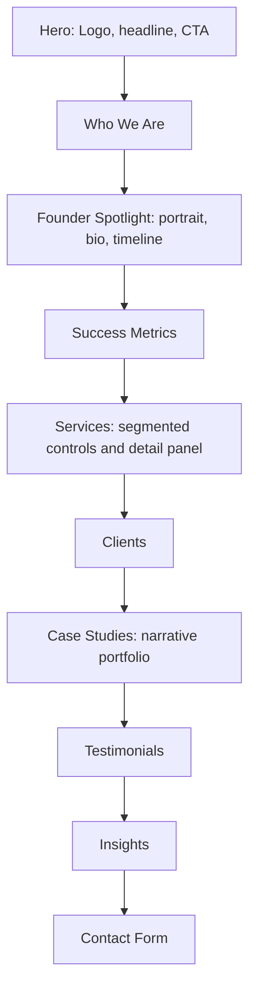
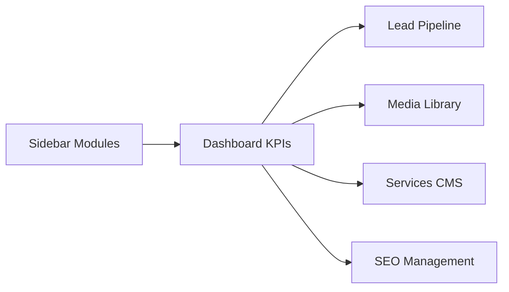

# Wireframes

## Public Site

```mermaid
flowchart TD
  A["Hero: Logo, headline, CTA"] --> B["Who We Are"]
  B --> C["Founder Spotlight: portrait, bio, timeline"]
  C --> D["Success Metrics"]
  D --> E["Services: segmented controls and detail panel"]
  E --> F["Clients"]
  F --> G["Case Studies: narrative portfolio"]
  G --> H["Testimonials"]
  H --> I["Insights"]
  I --> J["Contact Form"]
```

## Admin

```mermaid
flowchart LR
  A["Sidebar Modules"] --> B["Dashboard KPIs"]
  B --> C["Lead Pipeline"]
  B --> D["Media Library"]
  B --> E["Services CMS"]
  B --> F["SEO Management"]
```
